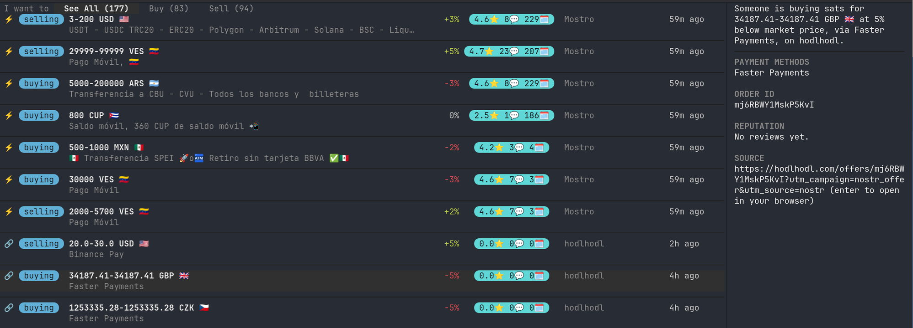

# monster

A [Mostro](https://mostro.network) order book daemon and terminal client. Mostro is a
non-custodial P2P Bitcoin/Lightning exchange built on Nostr; `monster` ingests its order
events straight from relays and gives you a live, filterable order book in your terminal.

Two binaries:

- **`monsterd`** — connects to Nostr relays, ingests Mostro order events (NIP-69, kind
  `38383`), resolves the publishing node's identity (NIP-01 kind-0 profile), and persists
  everything to SQLite. Serves the order book over HTTP (`GET /orders`) and live updates
  over SSE (`GET /orders/stream`).
- **`monstertui`** — a [bubbletea](https://github.com/charmbracelet/bubbletea) terminal
  client for it: buy/sell tabs (order-book convention — see below), a filterable table,
  and a detail sidebar.



## Quick start

The simplest way to run the client — no separate daemon needed:

```sh
go run ./cmd/monstertui
```

With no `-endpoint` flag, `monstertui` starts its own embedded `monsterd` in-process
(in-memory database, random local port) and connects to that. Good for just looking at
the order book; nothing persists across runs.

To run them separately (e.g. so the order history persists, or multiple clients share one
daemon):

```sh
go run ./cmd/monsterd                                    # starts on :8080, writes orders.db
go run ./cmd/monstertui -endpoint http://localhost:8080
```

## monsterd

```
monsterd [flags]

  -relays string
        comma-separated relay URLs
        (default "wss://mostro-p2p.tech,wss://nos.lol,wss://relay.mostro.network")
  -db string
        path to sqlite database (default "orders.db")
  -addr string
        HTTP API listen address (default ":8080")
```

On first run against an empty database it backfills the last 48 hours of order history
instead of the relay's entire backlog; subsequent runs resume from the last event seen.

### HTTP API

- `GET /orders?type=&status=&fiat_code=` — current order book, optionally filtered.
- `GET /orders/stream` — Server-Sent Events feed of `{"type":"created"|"updated","order":{...}}`
  as orders are ingested or change status.

## monstertui

```
monstertui [flags]

  -endpoint string
        monsterd API base URL (e.g. http://localhost:8080); if empty, monstertui
        starts its own embedded server on a random port
  -relays string
        comma-separated relay URLs, used only when -endpoint is not set
        (default "wss://mostro-p2p.tech,wss://nos.lol,wss://relay.mostro.network")
  -filter string
        initial filter query, e.g. "cur:usd,eur pm:zelle"
```

### Order book convention

The **Buy** tab lists *sell*-type orders — the liquidity you'd buy from — and **Sell**
lists *buy*-type orders, matching how exchanges present a book (bids vs. the offers that
fill them). Each row still honestly labels its own side with a `buying`/`selling` pill.

### Keys

| Key | Action |
|---|---|
| `↑`/`k`, `↓`/`j` | move selection |
| `←`/`h`, `→`/`l`, `tab` | switch tabs |
| `1` / `2` / `3` | jump to See All / Buy / Sell |
| `/` | open the filter box |
| `enter` (while filtering) | apply filter, keep navigating |
| `esc` (while filtering) | clear filter, exit filter box |
| `enter` (on a row) | open the order's `https://` source link in your browser, if it has one |
| `q`, `ctrl+c` | quit |

### Filter syntax

Type `/` to open the filter box. It's a small structured query, not a single free-text
match:

```
cur:usd,eur pm:zelle,cash some-node-name
```

- `cur:` / `currency:` — one or more currency codes, comma-separated (OR within the facet)
- `pm:` / `payment:` — one or more payment-method substrings, comma-separated
- any other bare word — matched against the publishing node's identity

Facets are independent and AND together — `cur:usd pm:zelle` requires *both*. Within a
facet, multiple values OR — `cur:usd,eur` matches either currency. Pass an initial query
non-interactively with `-filter`.

## Architecture

```
internal/mostro   NIP-69 order + NIP-01 profile parsing
internal/store    Store interface (order/profile persistence)
internal/store/sqlite   SQLite implementation
internal/api      HTTP handlers + SSE hub
internal/daemon   relay ingestion loop, shared by monsterd and monstertui's autostart
cmd/monsterd      daemon binary
cmd/monstertui    TUI client binary
```

## Requirements

Go 1.26+. `monstertui`'s buy/sell and reputation pills use Nerd Font Powerline
round-separator glyphs (`U+E0B6`/`U+E0B4`) for their rounded look — without a
[Nerd Font](https://www.nerdfonts.com/)-patched terminal font they'll render as
tofu/missing-glyph boxes instead of rounded caps. Currency flags and other emoji need
reasonable Unicode font coverage but don't require a Nerd Font.
